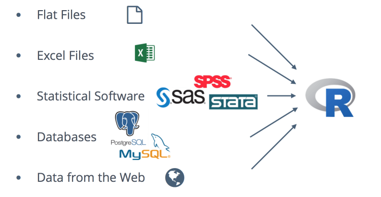

# Overview

## Why R

## Goals 

### **You will learn:**

 Data science cycle (source: [R for Data Science](http://r4ds.had.co.nz/))

 
### **You won’t learn**

+ Big data  

+ Non-rectangular data

+ Hypothesis confirmation

## Data import 

## Data tidying and transformation 

## Data visualisation and modeling

## Results communication 

## Outline
### __Day 1__ 

#### [R demo](Rdemo.Rmd)    

#### R data structures

#### Data visualisation with __ggplot2__ 

#### Data transformation with __dplyr__ 

### __Day 2__

#### Data transformation with __dplyr__    

#### Data wrangling

* Tiblles with **tibble**
* Data import

#### Data visualisation with __ggplot2__ 
#### Data transformation with __dplyr__ 

### Theoery and hands on labs:
  + Data exploration (Visualisation and transform)   
  + Data wrangeling (import, tidying and transform) 
  + Data modeling 
  + Results communication
